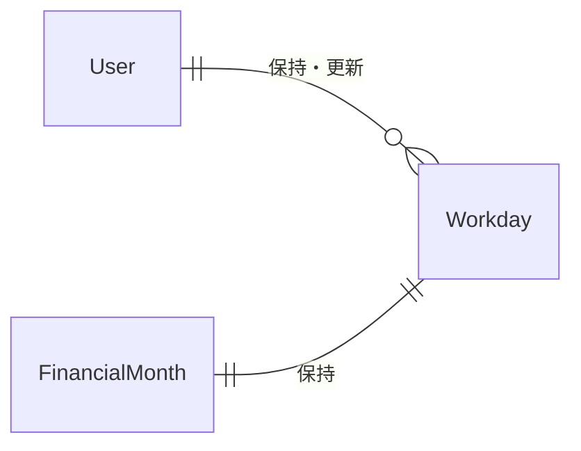
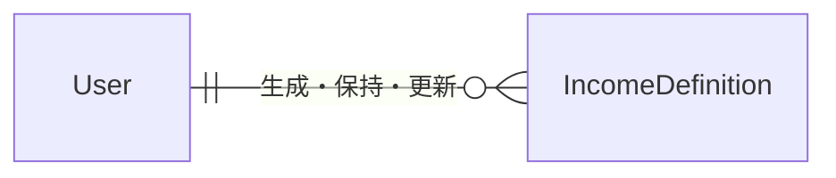
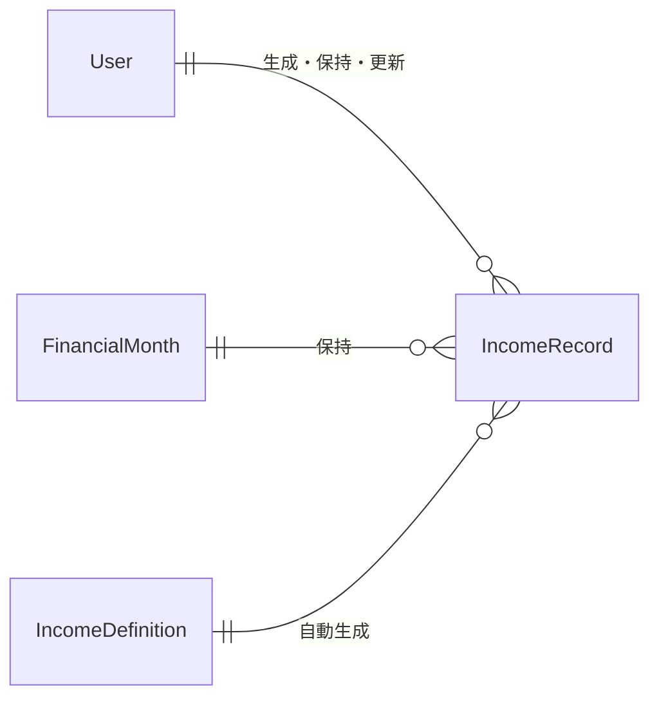

# 基本的な概念

## Words

ドキュメントにおける用語を整理します。

- **financier**
  システムの名称です。フランス語を踏襲し「フィナンシエ」と発音します。
- **会計年度**
  収支を整理・分類する単位年です。2024年度 を FY24 と表記することもあります。
- **ドメイン** / **インフラ**
  前者はビジネスロジック(システムが扱う処理)に着目したコンテキスト、後者は実装に着目したコンテキストです。
- **TBD**
  _To Be Defined_ の略です。

## Overview - frontend

###TBD### フロントエンドは現在設計されていません。

## Overview - backend

バックエンドの構成は以下のとおりです。

- lang: TypeScript
- frameworks:
  - web API: Hono
  - date processing: day.js
- testing:
  - framework: vitest
  - infra: miniflare
- architecture: ぼんやりClean Architectureもどき
- deployment infra:
  - work on: Cloudflare Workers
  - database: Cloudflare D1
- authentication/authorization: Auth0

## Entities

financierバックエンドは以下のエンティティを持ちます。

- ユーザ `User`
  - システムを利用するユーザを扱います。
- 会計月度 `FinancialMonth`
  - 会計年度における各月を扱います。
- 勤務日数 `Workday`
  - 会計月度における勤務日数を扱います。
- 報酬定義 `IncomeDefinition`
  - 会計年度および会計月度とは独立した、"いち会計月度に発生する報酬"を扱います。
- 控除定義 `DeductionDefinition`
  - 会計年度および会計月度とは独立した、"いち会計月度に発生する控除"を扱います。
- 報酬実績 `IncomeRecord`
  - ある報酬定義について、ある会計月度に発生する報酬を扱います。
- 控除実績 `DeductionRecord`
  - ある控除定義について、ある会計月度に発生する控除を扱います。
- 標準報酬月額 `StandardIncome`
  - 健康保険料や厚生年金保険料を計算する際に用いるルックアップテーブルを扱います。

以下に各エンティティの詳細を示します。

### User

システムを利用するユーザを扱います。
最新の定義は [`User`](/backend/src/features/users/domain/entity.ts) を参照ください。

| name          | type   | note                               |
| ------------- | ------ | ---------------------------------- |
| id            | string | エンティティ識別子, プライマリキー |
| name          | string | ユーザ名 (表示名)                  |
| email         | string | メールアドレス                     |
| auth0_user_id | string | Auth0のユーザ識別子                |

`auth0_user_id` は認可に使用します。フロントエンドより渡されたJWTから `sub` クレームを取り出し、
合致するユーザエンティティを取得して "ログインユーザ" として扱います。
詳細は [`userMiddleware`](/backend/src/features/users/presentation/middleware.ts) を参照ください。

### FinancialMonth

会計年度における各月を扱います。
最新の定義は [`FinancialMonth`](/backend/src/features/financial_months/domain/entity.ts) を参照ください。

| name           | type   | note                               |
| -------------- | ------ | ---------------------------------- |
| id             | string | エンティティ識別子, プライマリキー |
| user_id        | string | ユーザ識別子, 外部キー             |
| financial_year | number | 会計年度                           |
| month          | number | 会計月度                           |
| started_at     | number | 月度開始日時(timestamp)            |
| ended_at       | number | 月度終了日時(timestamp)            |

`user_id` はユーザエンティティのプライマリキーを参照します。
また、 `user_id` と `financial_year` , `month` でunique制約を設定しています。
これにより、ユーザはある会計年度における同一の会計月度を作成できないようになっています。

会計月度は単一の会計年度に必ず12レコード存在し、これが年度内の各月に対応します。
システムは会計年度の初期化時にこのエンティティを12個生成します。

`started_at`, `ended_at` はインフラレベルでのみ存在する属性です。
このエンティティがいつ始まり、いつ終わるのかを保持します。ドメインエンティティはこの値を持ちません。

これら属性は、データをクエリする際の範囲指定を効率化するために定義されています。

financierは日本の財政法第11条、すなわち

> 国の会計年度は、毎年四月一日に始まり、翌年三月三十一日に終るものとする。

に従います。ゆえに2024年度の1月は実際には2025年1月となり、financial_yearとmonthだけでは
日付範囲での検索が面倒になってしまいます。これを回避するため、開始・終了日時のタイムスタンプを別途保持しています。

なお、このエンティティは更新および削除を想定しません。

### Workday

会計月度における勤務日数を扱います。
最新の定義は [`Workday`](/backend/src/features/workdays/domain/entity.ts) を参照ください。

| name               | type   | note                               |
| ------------------ | ------ | ---------------------------------- |
| id                 | string | エンティティ識別子, プライマリキー |
| user_id            | string | ユーザ識別子, 外部キー             |
| financial_month_id | string | 会計月度識別子, 外部キー           |
| count              | number | 勤務日数                           |
| updated_at         | number | 最終更新日時(timestamp)            |

`financial_month_id` は会計月度エンティティのプライマリキーを参照します。

このエンティティは単一の会計月度における勤務日数を表します。
会計月度が作成される際に併せて生成され、デフォルトでは月度から土日および祝日を除いた日数が設定されます。

このエンティティはユーザによる更新を想定します(削除は想定しません)。
システムなエンティティの更新時に `updated_at` を更新日時へ再設定します。

### IncomeDefinition

会計年度および会計月度とは独立した、"いち会計月度に発生する報酬"を扱います。
最新の定義は [`IncomeDefinition`](/backend/src/features/definitions/income/domain/entity.ts) を参照ください。

| name        | type    | note                               |
| ----------- | ------- | ---------------------------------- |
| id          | string  | エンティティ識別子, プライマリキー |
| user_id     | string  | ユーザ識別子, 外部キー             |
| name        | string  | 定義名                             |
| kind        | string  | 種別                               |
| value       | number  | 値                                 |
| is_taxable  | boolean | 課税対象かどうか                   |
| enabled_at  | number  | 報酬開始日時(timestamp)            |
| disabled_at | number  | 報酬終了日時(timestamp)            |
| updated_at  | number  | 最終更新日時(timestamp)            |

このエンティティは会計月度に発生する報酬の種別と値を表します。

"名前" はそのまま定義の名前を表します。`基本給`, `通勤手当` などを想定します。

報酬の"種別"は以下のふたつに分類されます。

- 定数 _absolute_ : 月度ごと決まった値で発生する報酬。基本給などが該当します。
- 勤務日数に比例 _related_by_workday_ : 月度の勤務日数に比例して決定される報酬。通勤手当などが該当します。

"値"は種別が _absolute_ であれば即値(_immidiate_)、_related_by_workday_ であれば日毎の単価を表します。

"課税対象かどうか"は、厚生年金保険料の計算時に使用されるフラグです。デフォルトで `true` です。
###TBD### このフラグの利用方法は現在設計されていません。

"報酬開始日時"および"報酬終了日時"は、この報酬がいつからいつまで有効かを表します。
ドメインレイヤでは、これら値は会計月度と同じフォーマットで「FY24 4月からFY24 9月まで」のように与えます。
この場合、会計月度 4月,5月,6月,7月,8月,9月 の6個のエンティティが該当することになります。

このエンティティはユーザによる生成・更新を想定します(削除は想定しません)。
ただし、特定の属性を操作したり、定義を新規に生成したりする場合は特殊な操作が必要になります。
詳細は[報酬定義の操作](###TBD###)を参照ください。

### DeductionDefinition

会計年度および会計月度とは独立した、"いち会計月度に発生する控除"を扱います。

###TBD### このエンティティは現在設計されていません。

### IncomeRecord

ある報酬定義について、ある会計月度に発生する報酬を扱います。
最新の定義は [`IncomeRecord`](/backend/src/features/records/income/domain/entity.ts) を参照ください。

| name                 | type   | note                                 |
| -------------------- | ------ | ------------------------------------ |
| user_id              | string | ユーザ識別子, 外部キー               |
| financial_month_id   | string | 会計月度識別子, 外部キー, 複合主キー |
| income_definition_id | string | 報酬定義識別子, 外部キー, 複合主キー |
| value                | number | 報酬額                               |
| updated_at           | number | 最終更新日時(timestamp)              |
| updated_by           | string | 最終更新者                           |

`income_definition_id` は報酬定義エンティティのプライマリキーを参照します。

このエンティティは会計月度において報酬定義から実際に算出された報酬額を表します。

"最終更新者" は以下のふたつの値をとります。

- `user`: ユーザが手作業で値を更新した場合。
- `system`: システムの自動計算ロジックによって生成した場合。

報酬定義に基づく報酬実績の自動計算ロジックについては[報酬の自動計算](/spec/automated_income_calculation.md)を参照ください。

### DeductionRecord

ある控除定義について、ある会計月度に発生する控除を扱います。

###TBD### このエンティティは現在設計されていません。

### StandardIncome

健康保険料や厚生年金保険料を計算する際に用いるルックアップテーブルを扱います。

###TBD### このエンティティは現在設計されていません。
