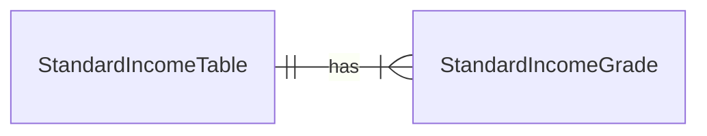

# 仕様

標準報酬月額とは、報酬の月額値を等級で区分したものである。等級は値域を持ち、各等級の値域は連続している。
たとえば報酬額が230,000円 ~ 250,000円の場合、標準報酬月額は240,000円となる。

等級は厚生年金保険と健康保険とで異なる。上述の値域を持つ等級は、健康保険では19、厚生年金保険では16となる。

ここで、等級間の値域は連続しているが、各等級における値域の幅は同一でない点に注意する必要がある。
たとえば、標準報酬月額が68,000円となる等級の値域は63,000円 ~ 73,000円であり、上述の等級とは値域幅が異なる。

## ドメインモデル

financierでは、標準報酬月額を ***StandardIncome*** と呼称する。(IncomeRecord, IncomeDefinitionに寄せている)
また、標準報酬月額の定義(等級とその値域)は変化しうるため、**標準報酬月額表 *StandardIncomeTable*** と **標準報酬月額等級 *StandardIncomeGrade*** というふたつのドメインモデルで管理する。

## 提供する機能

標準報酬月額表の操作および既存の月額表を複製する機能を提供する。ユーザが標準報酬月額を詳細に知る必要はないため、「ある月の標準報酬月額を得る機能」などのミクロな機能は実装しない。

### 標準報酬月額表の作成

名前と階級リストを受け取り、標準報酬月額表を作成する。

### 標準報酬月額表の更新

名前の更新と階級の更新とをそれぞれ別の機能として提供する。

### 標準報酬月額表の複製

あるIDの月額表と同じものを複製する機能を提供する。

### 標準報酬月額表の削除

現時点では削除機能は提供しない。

## 標準報酬月額の計算

簡単のため、 $Income_{std} = f(Income_{all}, tableId)$ のような2変数関数として扱う。

# 設計

## 型定義

それぞれの型を以下のように定義する。

```ts
/** 標準報酬月額等級 */
type StandardIncomeGrade = {
  /** 等級ID */
  id: number

  /** 閾値 */
  threshold: number

  /** 標準報酬月額 */
  standard_income: number
}
```

```ts
/** 標準報酬月額表 */
type StandardIncomeTable = {
  /** 表ID */
  id: string

  /** 表名 */
  name: string

  /** 等級配列 */
  grades: StandardIncomeGrade[]
}
```

ここで、thresholdは **値域の開始点** を表す。表の定義上、報酬がゼロであっても厚生年金保険料は発生し、月の報酬額が一定値を超えると保険料は頭打ちになるため、値域の上限値は設けない。

値域の連続性はドメインモデル生成時のバリデーションで担保する。

## DB

### 新規テーブル

定義した型に合わせてふたつのテーブルを新設する。



```sql
CREATE TABLE standard_income_tables (
  id TEXT PRIMARY KEY,
  name TEXT NOT NULL
);
```

```sql
CREATE TABLE standard_income_grades (
  id INTEGER PRIMARY KEY,
  threshold INTEGER NOT NULL,
  standard_income INTEGER NOT NULL
);
```

### 既存エンティティとのリレーション

標準報酬月額表の改定粒度は最小でも月単位で行われるため、会計月度エンティティに「その月に適用する表のID」カラムを追加する。

控除定義は

- 期間
- 種別 (定数値 / 報酬総額に対する比率 / 標準報酬月額に対する比率)
- 値 (控除額あるいは控除比率)

を持っているため、ある控除定義に対応するある会計月度の控除実績は

- 会計月度の報酬総額を計算し
- 月度が保持する表IDを持つ、報酬総額より小さい閾値を持つ等級レコードを降順に一つ取得して標準報酬月額とし
- 種別が `標準報酬月額に対する比率` になっているレコードに対して、値にそれを乗じて控除実績とする

のように計算される。

## ワークフロー

仕様で規定された各機能を実現するワークフローは以下の通りとする。

### 標準報酬月額表の取得(単一)

- 非バリデーションコマンドの生成
  - 入力をスキーマでパース (Honoが担保)
    - エンティティID
  - `state.user` にリクエスト元のユーザを設定
- ワークフロー
  - 既存エンティティ取得
  - 認可チェック
- エンティティをレスポンスとして返す

### 標準報酬月額表の取得(リスト)

- 非バリデーションコマンドの生成
  - 入力をスキーマでパース (Honoが担保)
    - 順序(asc / desc)
- ワークフロー
  - 既存エンティティ取得
  - 認可チェック
- エンティティをレスポンスとして返す

### 標準報酬月額表の作成

- 非バリデーションコマンドの生成
  - 入力をスキーマでパース (Honoが担保)
    - 名前
    - 階級[]
  - `state.user` にリクエスト元のユーザを設定
- ワークフロー
  - バリデーション
    - 標準報酬月額の階級値が連続しており、それぞれの月額値が地域に入っていることを確認
  - イベント生成
    - daoに直接流し込める形に変換
- イベントの実行
  - daoの `insertStandardIncomeTable` に渡して月額表を生成

### 標準報酬月額表名の更新

- 非バリデーションコマンドの生成
  - 入力をスキーマでパース (Honoが担保)
    - 名前
    - 既存エンティティID
  - `state.user` にリクエスト元のユーザを設定
- ワークフロー
  - バリデーション
    - 特に何もしない(非バリデーションコマンド = バリデーション)
  - 既存エンティティ検索
    - idに対応するエンティティを取得
  - イベント生成
    - daoに直接流し込める形に変換
- イベントの実行
  - daoの `updateStandardIncomeTableName` に渡して更新

### 標準報酬月額階級の更新

- 非バリデーションコマンドの生成
  - 入力をスキーマでパース (Honoが担保)
    - 階級[]
    - 既存エンティティID
  - `state.user` にリクエスト元のユーザを設定
- ワークフロー
  - バリデーション
    - 標準報酬月額の階級値が連続しており、それぞれの月額値が地域に入っていることを確認
  - 既存エンティティ検索
    - idに対応するエンティティを取得
  - イベント生成
    - daoに直接流し込める形に変換
- イベントの実行
  - daoの `updateStandardIncomeTableGrades` に渡して更新

### 標準報酬月額表の複製

- 非バリデーションコマンドの生成
  - 入力をスキーマでパース (Honoが担保)
    - 新テーブルの名前
    - 既存エンティティID
  - `state.user` にリクエスト元のユーザを設定
- ワークフロー
  - バリデーション
    - 特に何もしない(非バリデーションコマンド = バリデーション)
  - 既存エンティティ検索
    - idに対応するエンティティを取得
  - イベント生成
    - daoに直接流し込める形に変換
- イベントの実行
  - daoの `duplicateStandardIncomeTable` に渡して複製

## ルーティング

各機能へのルーティングは以下の通りとする。

TBD
